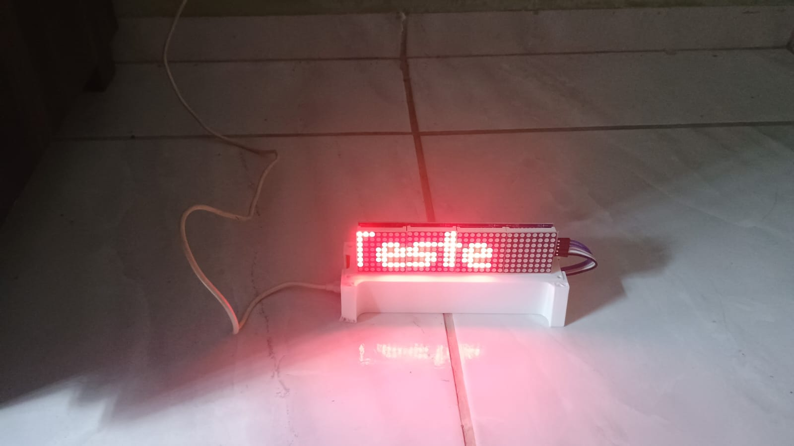
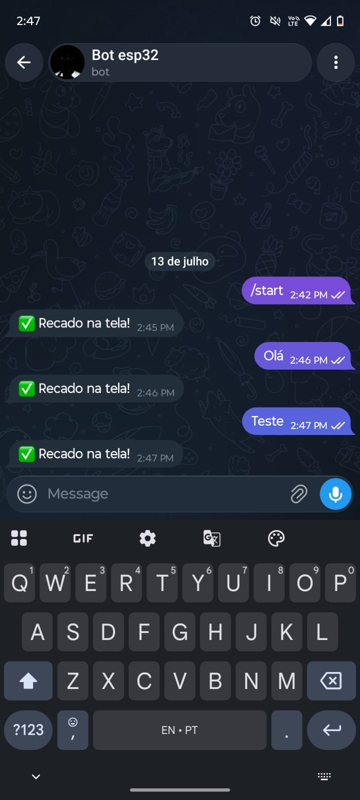
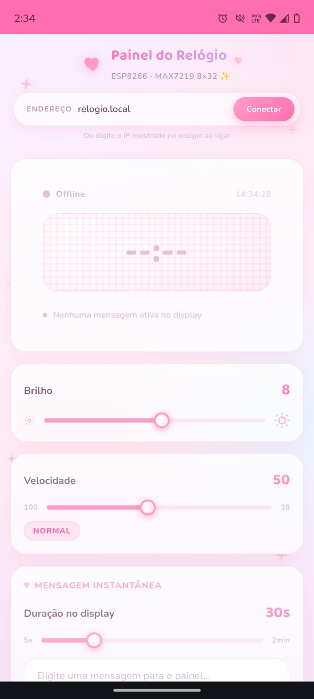
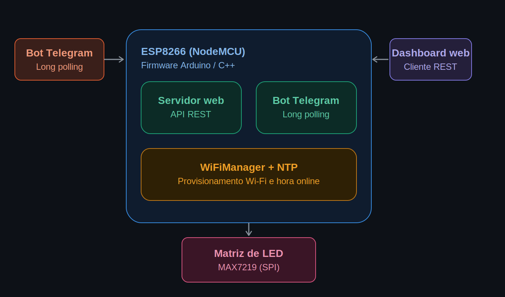
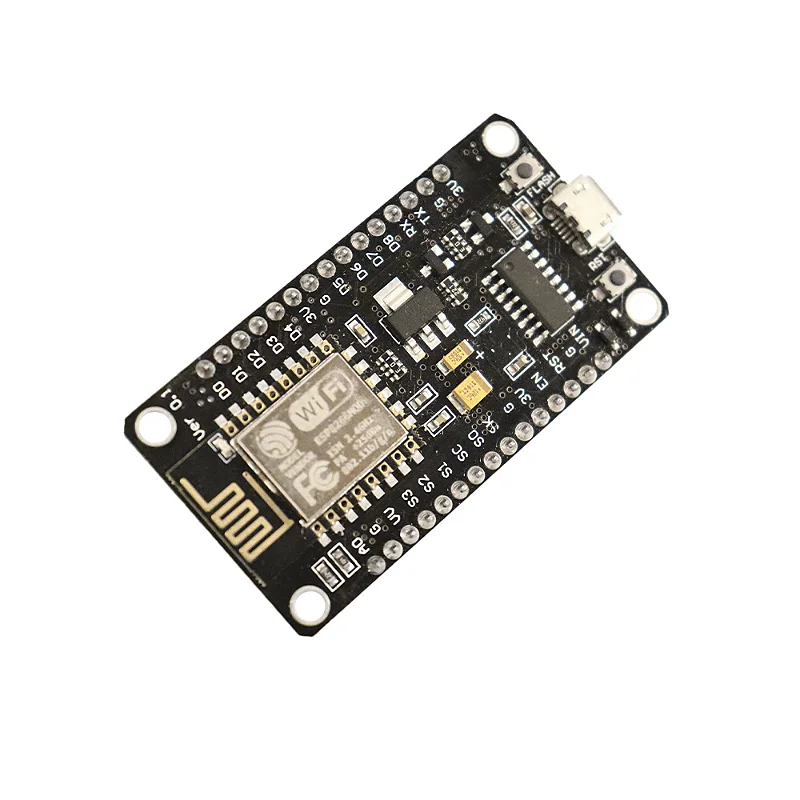
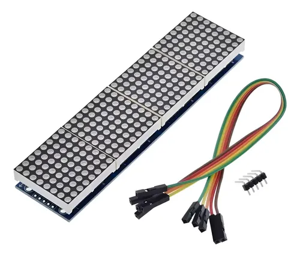
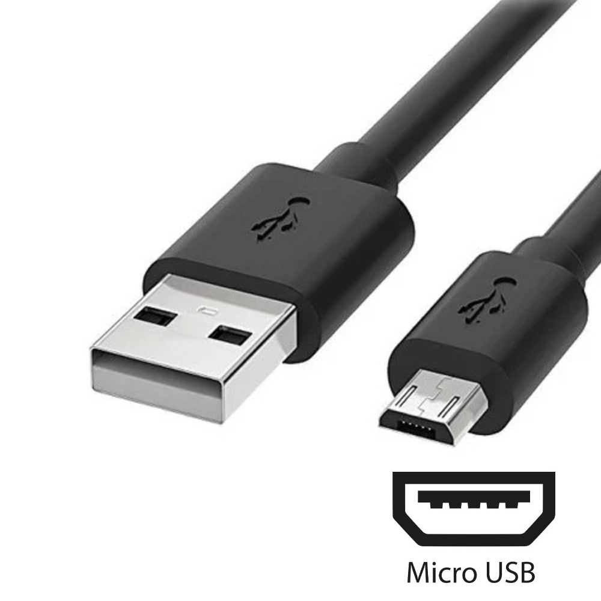

<div align="center">

# LED Matrix Clock & Telegram Bot

### Relógio inteligente com matriz de LED, controlado via Telegram e Dashboard Web

[](#)
[](#)
[](#)
[](#)
[](#)

</div>

---

## Sumário

- [Visão Geral](#visão-geral)
- [Demonstração](#demonstração)
- [Funcionalidades](#funcionalidades)
- [Arquitetura do Projeto](#arquitetura-do-projeto)
- [Tecnologias e Ferramentas Utilizadas](#tecnologias-e-ferramentas-utilizadas)
- [Componentes de Hardware](#componentes-de-hardware)
- [Diagrama de Ligação](#diagrama-de-ligação)
- [Instalação e Configuração](#instalação-e-configuração)
- [Bibliotecas Necessárias](#bibliotecas-necessárias)
- [Documentação da API REST](#documentação-da-api-rest)
- [Como Usar o Bot do Telegram](#como-usar-o-bot-do-telegram)
- [Estrutura do Código](#estrutura-do-código)
- [Melhorias Futuras](#melhorias-futuras)
- [Autor](#autor)

---

## Visão Geral

Este projeto transforma um **ESP8266** e uma **matriz de LED (MAX7219/FC16)** em um relógio digital inteligente e conectado. O dispositivo exibe o horário atualizado via NTP e permite a exibição de mensagens personalizadas enviadas remotamente através de um **Bot do Telegram**, além de oferecer uma **API REST** própria para integração com um **Dashboard Web** de controle (brilho, velocidade de rolagem, ativação do bot e envio de mensagens).

O objetivo é unir automação residencial, IoT e comunicação em tempo real em um único dispositivo compacto, de fácil configuração e sem necessidade de reprogramação para trocar de rede Wi-Fi (graças ao WiFiManager).

<div align="center">
<br>



<br>
</div>

---

## Demonstração

<div align="center">

|        Relógio em funcionamento        |   Mensagem recebida via Telegram    |          Dashboard Web          |
| :------------------------------------: | :---------------------------------: | :-----------------------------: |
|  |  |  |

</div>

---

## Funcionalidades

- **Relógio em tempo real**: sincronização automática de hora via protocolo NTP.
- **Integração com Telegram**: qualquer mensagem enviada ao bot é exibida instantaneamente na matriz de LED.
- **Dashboard Web / API REST**: controle remoto de brilho, velocidade da rolagem, tempo de exibição e status do dispositivo.
- **Configuração Wi-Fi sem código**: uso do WiFiManager, que cria um ponto de acesso (AP) para configuração da rede na primeira inicialização.
- **Acesso via mDNS**: dispensa a necessidade de descobrir o IP do dispositivo manualmente (`http://clock.local`).
- **CORS habilitado**: permite que o dashboard seja hospedado separadamente e consuma a API sem restrições de origem.
- **Ativação/desativação do bot**: possibilidade de pausar o recebimento de mensagens do Telegram remotamente.

---

## Arquitetura do Projeto

<div align="center">



</div>

---

## Tecnologias e Ferramentas Utilizadas

<div align="center">

| Categoria              | Tecnologia                                              |
| ---------------------- | ------------------------------------------------------- |
| Microcontrolador       | ESP8266 (NodeMCU / Wemos D1 Mini)                       |
| Linguagem              | C++ (Arduino Framework)                                 |
| IDE                    | Arduino IDE / PlatformIO                                |
| Comunicação            | HTTP REST API, Long Polling (Telegram Bot API)          |
| Sincronização de Tempo | NTP (Network Time Protocol)                             |
| Configuração de Rede   | WiFiManager (Portal Cativo)                             |
| Descoberta de Rede     | mDNS                                                    |
| Formato de Dados       | JSON (ArduinoJson)                                      |
| Display                | Matriz de LED MAX7219 (Driver FC16), controlada via SPI |

</div>

---

## Componentes de Hardware

- 1x Placa ESP8266 (NodeMCU ou similar)
- 4x Módulos de matriz de LED 8x8 com driver MAX7219 (padrão FC16)
- 1x Fonte de alimentação 5V compatível com o consumo dos módulos
- Cabos jumper para as conexões SPI
- Protoboard ou PCB para montagem (opcional)

<div align="center">

|          NodeMCU ESP8266          |         Matriz de LED (MAX7219)         |              Cabo Micro USB               |
| :-------------------------------: | :-------------------------------------: | :---------------------------------------: |
|  |  |  |

</div>

---

## Diagrama de Ligação

| ESP8266 (Pino) | Matriz de LED (MAX7219) |
| -------------- | ----------------------- |
| D8 (GPIO15)    | CS                      |
| D7 (GPIO13)    | DIN                     |
| D5 (GPIO14)    | CLK                     |
| 3V3 / 5V       | VCC                     |
| GND            | GND                     |

> Observação: os pinos de dados e clock (`DIN`/`CLK`) seguem o barramento SPI padrão do ESP8266 e são definidos automaticamente pela biblioteca `MD_MAX72xx`.

---

## Instalação e Configuração

### 1. Pré-requisitos

- Arduino IDE instalada, com suporte à placa ESP8266 configurado no Boards Manager.
- Um Bot criado no Telegram através do [@BotFather](https://t.me/BotFather), com o **Token** gerado.

### 2. Clonando o repositório

```bash
git clone https://github.com/victor-kauan-coder/nome-do-repositorio.git
cd nome-do-repositorio
```

### 3. Configurando o Token do Bot

No arquivo `controlador.ino`, substitua o valor abaixo pelo token fornecido pelo BotFather:

```cpp
#define BOT_TOKEN "SEU_TOKEN_AQUI"
```

### 4. Upload do código

1. Selecione a placa correta em `Ferramentas > Placa` (ex: NodeMCU 1.0).
2. Selecione a porta serial correspondente.
3. Compile e faça o upload do sketch para o ESP8266.

### 5. Primeira configuração de rede

Ao ligar pela primeira vez, o dispositivo criará uma rede Wi-Fi chamada **`Clock_Telegram`**. Conecte-se a ela com o celular ou computador, selecione sua rede doméstica e informe a senha através do portal de configuração do WiFiManager.

### 6. Acesso ao dispositivo

Após conectado, o dispositivo pode ser acessado na rede local através de:

http://clock.local

Ou pelo IP exibido na própria matriz de LED durante a inicialização.

---

## Bibliotecas Necessárias

Instale as seguintes bibliotecas pelo Gerenciador de Bibliotecas da Arduino IDE:

| Biblioteca             | Finalidade                                           |
| ---------------------- | ---------------------------------------------------- |
| `ESP8266WiFi`          | Conectividade Wi-Fi do ESP8266                       |
| `ESP8266WebServer`     | Servidor web e rotas da API REST                     |
| `ESP8266mDNS`          | Resolução de nome local (`clock.local`)              |
| `WiFiClientSecure`     | Conexão segura (HTTPS) com a API do Telegram         |
| `UniversalTelegramBot` | Comunicação com a Bot API do Telegram                |
| `ArduinoJson`          | Serialização/deserialização de dados JSON            |
| `MD_Parola`            | Controle de efeitos e textos na matriz de LED        |
| `MD_MAX72xx`           | Driver de baixo nível da matriz MAX7219              |
| `WiFiManager`          | Portal cativo para configuração de rede sem hardcode |

---

## Documentação da API REST

Todas as rotas retornam respostas em formato JSON e possuem CORS habilitado.

### `GET /status`

Retorna o estado atual do dispositivo.

**Resposta:**

```json
{
  "online": true,
  "time": "14:32",
  "brightness": 3,
  "speed": 50,
  "telegram": true,
  "isMessageActive": false,
  "messageDuration": 30
}
```

### `GET /setBrightness?value=0-15`

Ajusta o brilho da matriz de LED.

| Parâmetro | Tipo    | Intervalo |
| --------- | ------- | --------- |
| `value`   | inteiro | 0 a 15    |

### `GET /setSpeed?value=10-100`

Ajusta a velocidade de rolagem do texto.

| Parâmetro | Tipo    | Intervalo |
| --------- | ------- | --------- |
| `value`   | inteiro | 10 a 100  |

### `GET /setMessage?text=...&duration=...`

Exibe uma mensagem personalizada na matriz de LED.

| Parâmetro  | Tipo               | Obrigatório | Intervalo |
| ---------- | ------------------ | ----------- | --------- |
| `text`     | string             | Sim         | —         |
| `duration` | inteiro (segundos) | Não         | 3 a 300   |

### `GET /toggleTelegram?state=on|off`

Ativa ou desativa o recebimento de mensagens via Telegram.

| Parâmetro | Tipo   | Valores       |
| --------- | ------ | ------------- |
| `state`   | string | `on` ou `off` |

---

## Como Usar o Bot do Telegram

1. Localize o bot no Telegram utilizando o nome definido no BotFather.
2. Inicie uma conversa com o comando `/start`.
3. Envie qualquer mensagem de texto — ela será exibida automaticamente na matriz de LED.
4. O bot responderá com uma confirmação de que a mensagem foi exibida com sucesso.

---

## Estrutura do Código

controlador.ino
├── Configurações do Telegram → Token, intervalo de checagem, cliente seguro
├── Configurações da Matriz de LED → Tipo de hardware, pinos, buffers de texto
├── Estado controlado pelo Dashboard → Brilho, velocidade, status do bot
├── Funções Auxiliares → updateClock(), showMessage(), checkMessages()
├── Rotas da API REST → handleStatus(), handleSetBrightness(), etc.
├── setup() → Inicialização de Wi-Fi, mDNS, NTP e servidor
└── loop() → Loop principal: servidor, animações e polling

---

## Melhorias Futuras

- [ ] Autenticação por Chat ID para restringir quem pode enviar mensagens ao bot.
- [ ] Suporte a múltiplos idiomas no fuso horário e formatação de hora.
- [ ] Persistência de configurações (brilho/velocidade) em memória não volátil.
- [ ] Suporte a temas e efeitos visuais adicionais na matriz de LED.
- [ ] Interface web embarcada diretamente no ESP8266 (sem dependência externa).

---

## Autor

<div align="center">


### Victor Kauan da Silva Miranda

**Software Developer**

[](https://github.com/victor-kauan-coder)

</div>

---

<div align="center">

_Projeto desenvolvido combinando eletrônica embarcada, automação e integração de APIs._

</div>
